# Environment Classification on the STM32 L4 
This project was developed by Jeremy Gerster, 5 Jul 2025, as part of the course: *Machine Learning on Microcontrollers*, ETH Zurich.<br>
The goal of the project was to deploy an Environmental Sound Classifier (based on the UrbanSound8K dataset) onto the STM32 B-L475E-IOT01A2 board, profile its performance, and compare it against alternative implementations and state-of-the-art models.<br>

---

## Demo:

https://github.com/user-attachments/assets/fd01e48a-573f-445d-ac64-141597460702

---

## Setup (Keras model only)

Create and activate a virtual environment, then install dependencies:
```bash
python -m venv venv
source venv/bin/activate
pip install -r requirements.txt
```
The steps involving dataset preprocessing, model training and evaluation steps are provided in `main.ipynb`.

---

### Problem & Goal
<p align="center">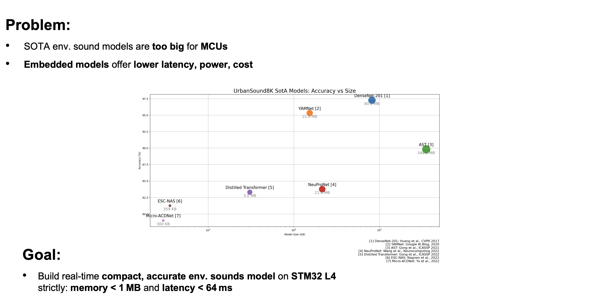</p>

### Dataset & Augmentation
<p align="center">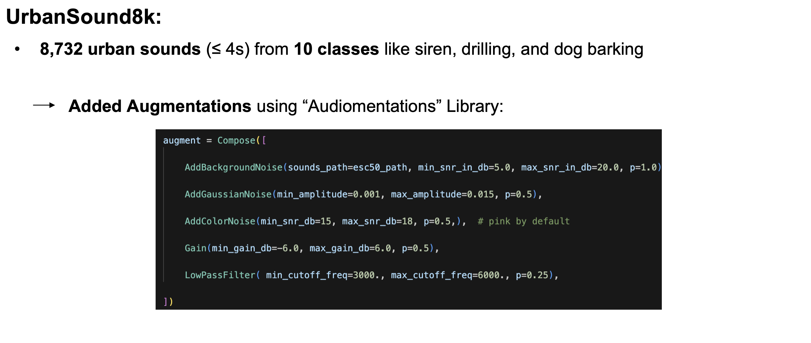</p>

### Preprocessing & Model Architecture
<p align="center">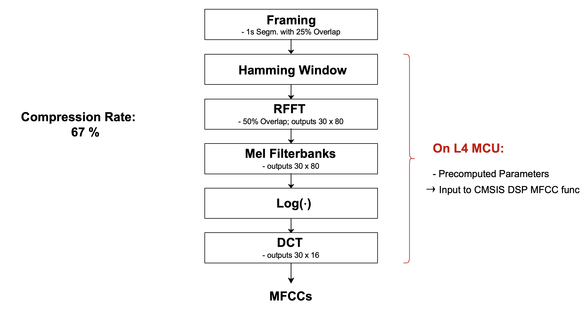</p>
<p align="center">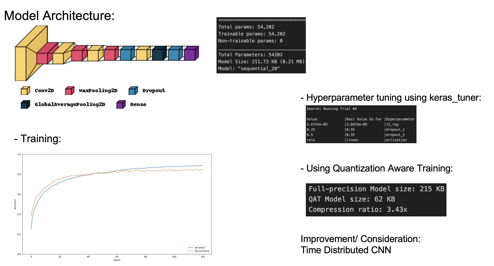</p>
<p align="center">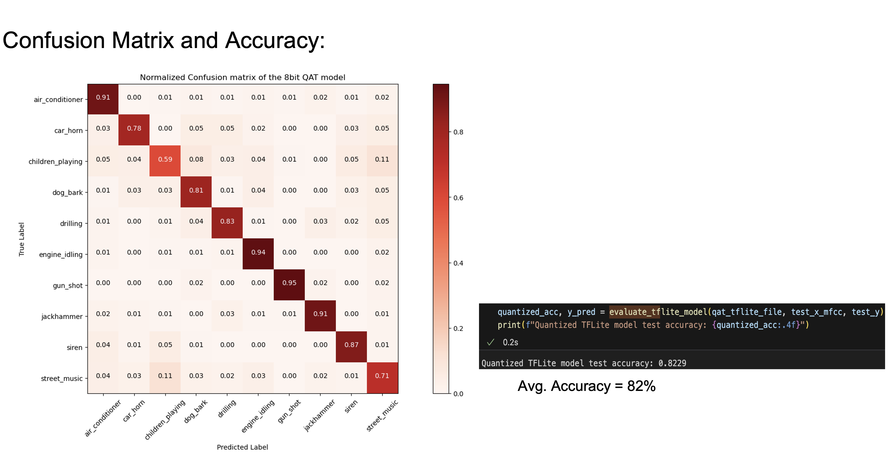</p>

### Hardware Platform & Implementation 
<p align="center">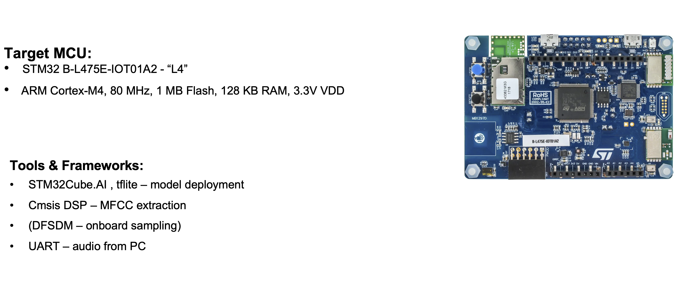</p>
<p align="center">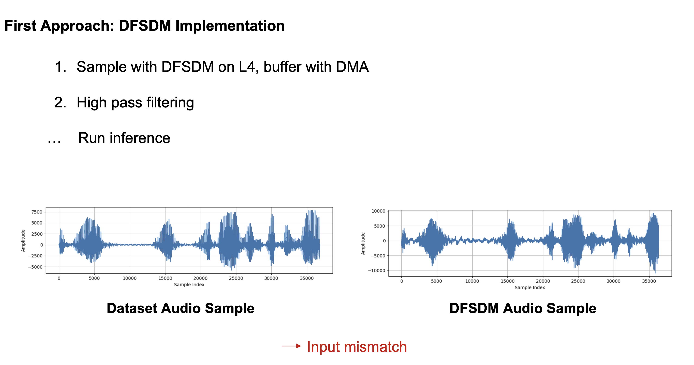</p>
<p align="center">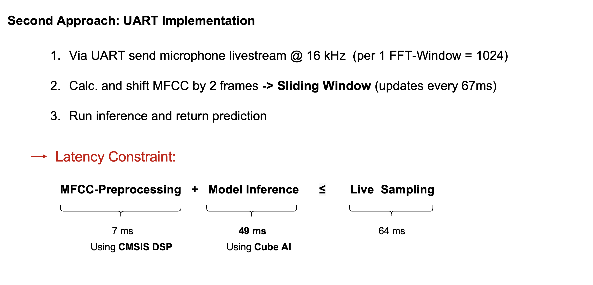</p>

### Experimental Evaluation 
<p align="center">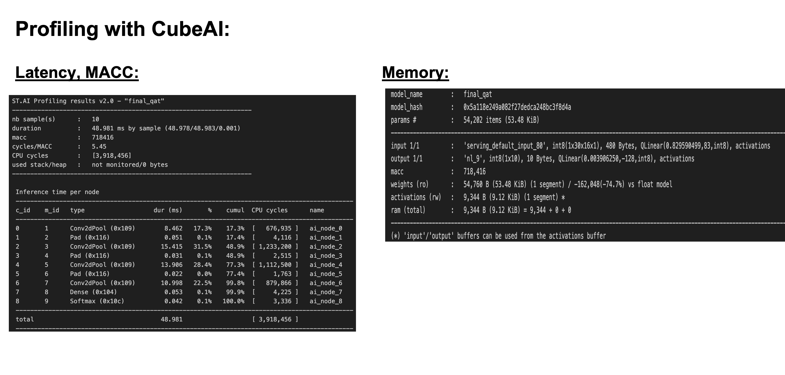</p>
<p align="center">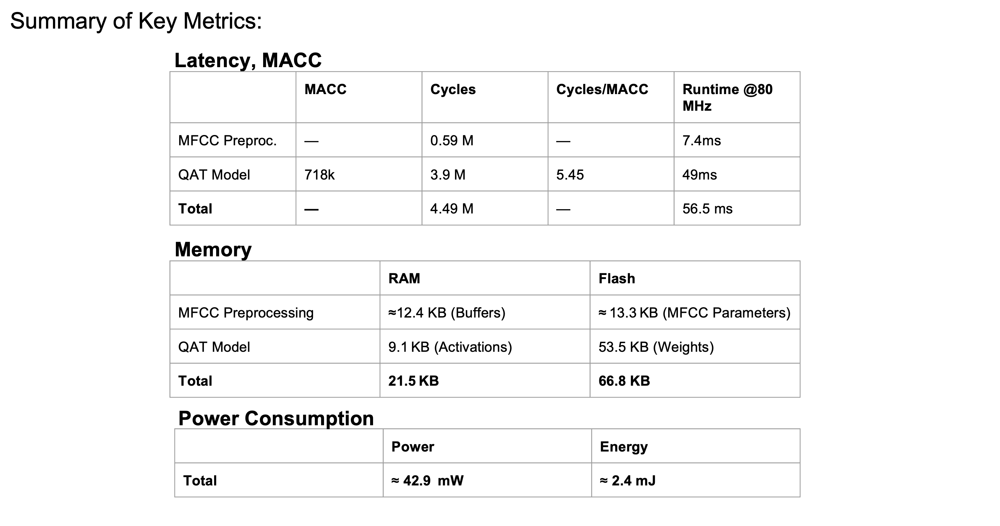</p>
<p align="center"></p>

### Comparisons
<p align="center">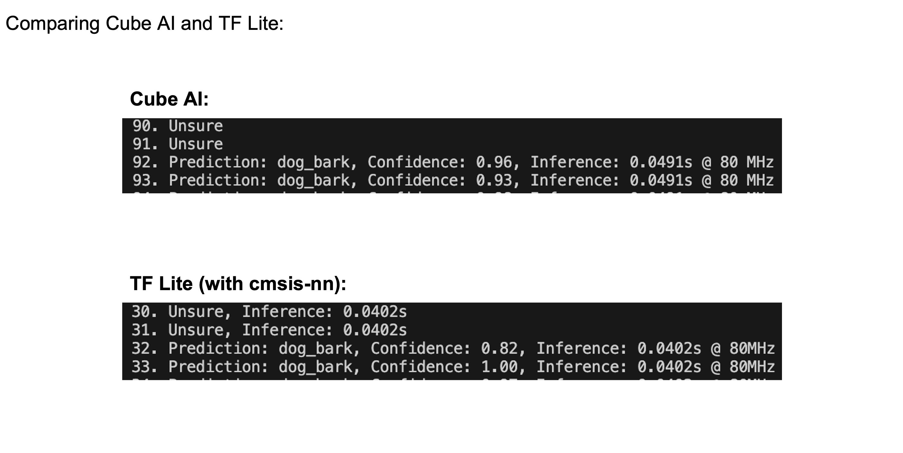</p>
<p align="center">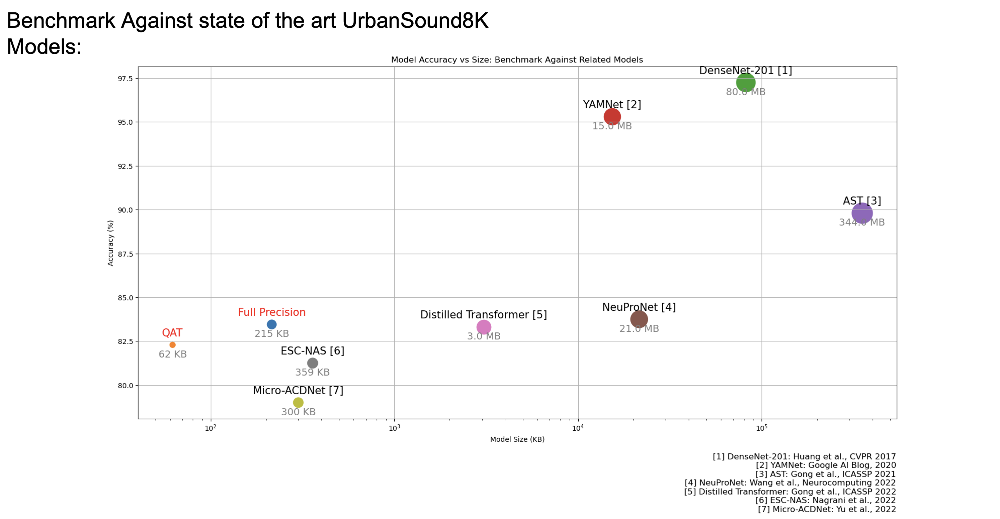</p>
